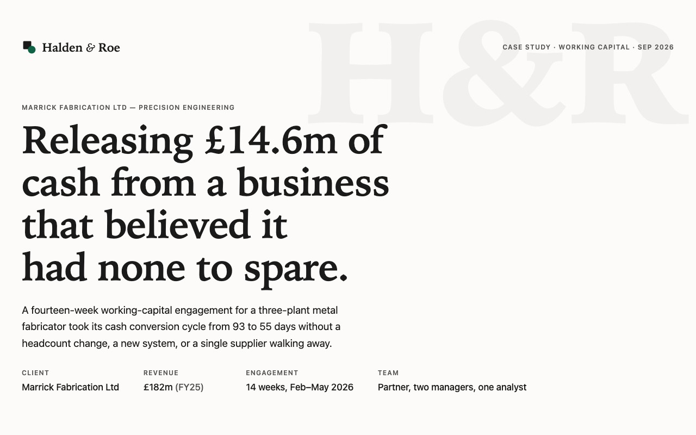
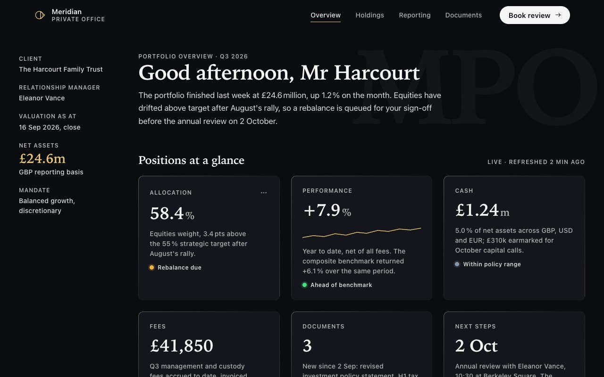
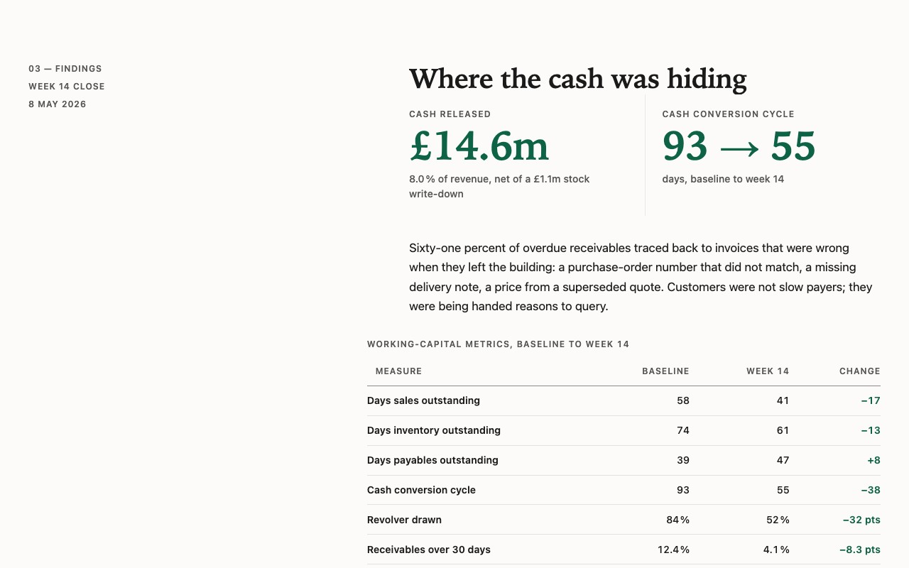
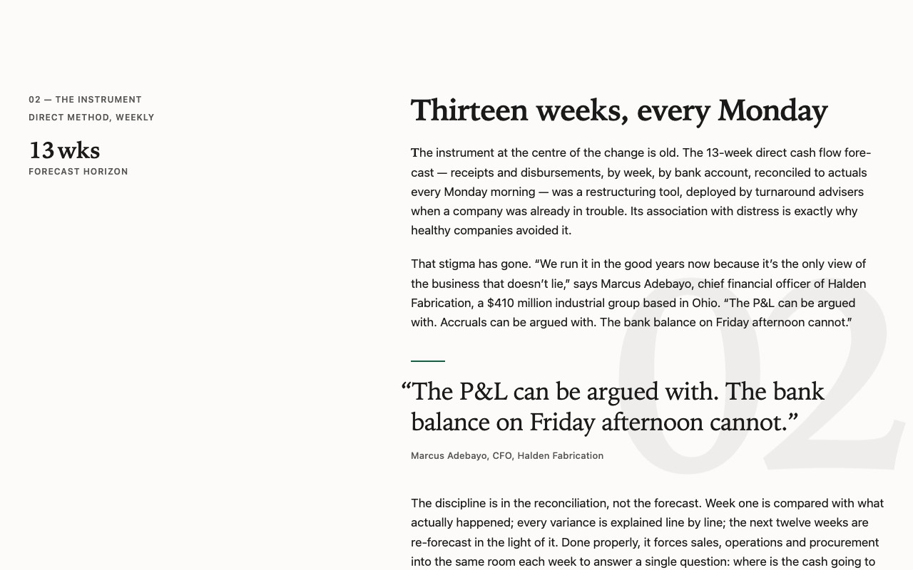

# Editorial Web Craft

**Twenty composable skills — and a `web-craft` orchestrator — for building web interfaces that feel printed, weighted, and considered: the way a consultancy ledger, a financial journal, or a well-set book feels, without the templated look of a default dashboard.**

Each skill is small, opinionated, and explains *why* before it says *how*. Most bundle a script that audits or generates, a reference table that saves a lookup, or a starter asset that already follows every other skill in the set. `web-craft` ties them together: it classifies a brief or an existing page, loads the right skills in the right order, builds, runs the combined audit, and previews the result in Chrome DevTools at three widths and under reduced motion.

<p align="center">
  
  
</p>
<p align="center">
  
  
</p>

<p align="center"><sub>Three pages built under the set during its review — <a href="examples/">examples/</a>. Every one passes all seven audits.</sub></p>

---

## Install

The same repository serves four environments. Pick the one you use.

**Claude Code** — plugin, with the `/editorial-web-craft:craft` command, the write-time audit hook, and a bundled Chrome DevTools MCP for previews:

```bash
claude plugin marketplace add fernandokylas/editorial-web-craft
claude plugin install editorial-web-craft@editorial-web-craft
```

**Any agent** (Cursor, Codex, Copilot, Windsurf, Gemini CLI, …) — via the open [skills CLI](https://github.com/vercel-labs/skills):

```bash
npx skills add fernandokylas/editorial-web-craft            # all 21
npx skills add fernandokylas/editorial-web-craft --skill web-craft
```

**Claude.ai** — upload a `.skill` file from the [latest release](https://github.com/fernandokylas/editorial-web-craft/releases) as a custom skill. `web-craft.skill` on its own runs in static mode (audit + checklist, no browser); the bundle zip has all twenty-one.

**Your own marketplace** — list it as one plugin among yours:

```json
{ "name": "editorial-web-craft", "source": { "source": "github", "repo": "fernandokylas/editorial-web-craft" }, "version": "1.0.0", "category": "design" }
```

**Local development** — `claude --plugin-dir ./editorial-web-craft`, or symlink: `for d in skills/*/; do ln -sfn "$PWD/${d%/}" ~/.claude/skills/$(basename $d); done`

> The DevTools MCP needs Node and Chrome. If you already run the official `chrome-devtools-mcp` plugin you'll see a second server with a different tool prefix — harmless; `web-craft` uses whichever is present.

---

## `web-craft` — the orchestrator

Say what you want and it does the rest: *"build a one-page case study for an advisory firm"*, *"make this landing page feel premium"*, `/editorial-web-craft:craft examples/dashboard.html`.

1. **Classifies** the job on five axes — kind (reading / grid / deck / mixed), ground (paper / obsidian / mixed), motion budget, network budget, new vs. improve.
2. **Routes** through [`routing.md`](skills/web-craft/references/routing.md): an always-on core (layers, both palettes, two faces, fluid sizes, rag, ink, native semantics, depth matrix, CLS anchors, motion safety net, optical polish) plus what the classification calls for — and skip rules for what it doesn't (no skeletons without async content, no magnetic fields off the CTA, no rail around a grid).
3. **Builds** from the self-contained boilerplate, or edits your file in place.
4. **Audits** with one command — `python3 skills/web-craft/scripts/audit.py page.html` — seven checkers, merged output, exit 1 on any FAIL.
5. **Previews** per [`preview-protocol.md`](skills/web-craft/references/preview-protocol.md): three widths with layout probes, interactive states, `prefers-reduced-motion` emulation ("nothing hidden, nothing moving"), a CLS/LCP trace — then judges the screenshots for what scripts can't see: hierarchy, rag, optical alignment, restraint.
6. **Iterates** up to three rounds and **reports**: what was applied and why, audit output, screenshot paths, open items.

For an existing page it audits and previews *first* and tells you what was wrong before changing anything. Without a browser it says so and hands you the checklist — it never claims a preview it didn't run.

---

## The twenty skills

### I. Structure

The page as a floor plan: where things sit, how they scale, how they stack.

| Skill | What it gives you |
|---|---|
| **`layout-editorial-rail`** | The signature layout — a narrow meta rail (headings, dates, labels) beside a copy column capped at 62ch. Replaces full-width text and centred containers with an asymmetric two-column grid that collapses gracefully, with a breakout class for wide tables that never spills past the container. |
| **`fluid-clamp-calculator`** | Type and space that scale continuously between 320px and 1440px instead of jumping at breakpoints. Six baseline `clamp()` tokens, and a calculator that derives exact `clamp(min, calc(a rem + b vw), max)` values so endpoints land precisely — with rem caps that survive browser zoom. |
| **`visual-weight-tuner`** | The typographer's corrections by eye: icons nudged to cap-height instead of flexbox's line box, buttons with a hair more bottom padding so labels don't sink, circles scaled up 10–15% so they match squares. A reference of seventeen optical adjustments, each with a starting value. |
| **`z-index-coordinate-matrix`** | Seven named depth tiers from `--z-subground` to `--z-critical` in place of `z-index: 99999`. Explains why most stacking bugs are a *trapped* element, not a small number — and that native `<dialog>` and `popover` live in the top layer and need no z-index at all. |
| **`cls-dimension-anchor`** | Nothing moves while it loads. Dimensions on every image and embed, `min-height` on every async region, font metric overrides so web-font swaps don't reflow, `scrollbar-gutter`, `content-visibility` with intrinsic size. A lint that finds the unreserved boxes. |

### II. Typography

Two faces, clean wrapping, and small text that stays legible.

| Skill | What it gives you |
|---|---|
| **`editorial-type-tokens`** | A display serif for H1/H2/hero and a quiet sans for everything else, mapped as tokens with weight, tracking and leading per role. Ten tested pairings by tone (financial, literary, luxury, studio…) with the weights worth loading and system-only stacks for offline artifacts. |
| **`typographic-rag-tuner`** | `text-wrap: balance` on headings so no word dangles alone; `text-wrap: pretty` on prose for a clean ragged edge. Plus what those can't do — keeping `Q3 2026` and `12 %` together, breaking URLs, hyphenating long words — and how to read a rag. |
| **`accessible-ink-scale`** | Small text loses its strokes; the fix is mechanical. Below 14px step up a weight; below 13px open the tracking; uppercase gets 0.08–0.12em; on dark grounds never pure white. A band table with verified contrast ratios and a lint for under-compensated micro-type. |

### III. Colour & surface

Light and dark grounds, edges that read as edges, graphics that inherit the theme.

| Skill | What it gives you |
|---|---|
| **`ground-inversion-guard`** | When a section flips from paper to obsidian, accents change *role*: a deep green fill on light becomes a bright mint text colour on dark. A paired token contract, a third token for text-on-fill, and a WCAG contrast checker with a matrix mode — every pair measured, nothing shipped under 7:1. |
| **`adaptive-luminescent-border`** | Retires `1px solid #ccc`. On paper, a debossed groove; on obsidian, a half-pixel luminous fibre with a hint of accent — one masked gradient stroke driven by ground tokens, a fading hairline rule, gap-dividers for grids, and a solid fallback for the boundaries that must stay 3:1. |
| **`inline-svg-decorator`** | Icons and dividers as inline SVG on integer coordinates with `currentColor`, never icon fonts, emoji, or a missing ``. Twenty crisp 24-grid icons, a sprite pattern, and a generator that emits wave, tilt, and step dividers from parameters. |
| **`perceived-latency-mask`** | Skeletons that mirror the exact layout of what's coming — same grid, bars at the real type sizes — with a compositor-only shimmer, a 300ms appear delay so fast loads never flash, a minimum hold, `aria-busy`, and a timeout with retry. Recipes for rails, cards, tables, and KPI tiles. |

### IV. Motion

Weight, choreography, and the discipline to switch it all off.

| Skill | What it gives you |
|---|---|
| **`tactile-interaction-curves`** | Buttons with mass: ease-out in under 300ms, faster out than in, an 80ms press that compresses to 0.97, never `transition: all`, never linear motion. Six named curves and recipes for buttons, cards, rows, toggles, menus, modals, and staggered reveals. |
| **`gsap-timeline-orchestrator`** | Section entrances as one GSAP timeline in reading order — rail, then headline, then copy — with 30–70ms staggers and hard ease-out. A drop-in module that handles the flash-of-content guard, reduced motion, ScrollTrigger for below-fold sections, and survives GSAP failing to load. |
| **`sub-pixel-inertia-scroll`** | The velvety scroll feel without hijacking the scroll: parallax planes on CSS scroll-driven animations (with a lerp fallback), arrivals on a heavy-tailed rest curve, gentle native snap decks. Find-in-page, keyboard paging, and screen readers keep working. |
| **`magnetic-hitbox-warp`** | An invisible field around a primary control that begins reacting before the cursor arrives, pulls the visual up to 6px toward the pointer, and springs back on exit. Pointer-only, a handful per view, the real button never moves from under the cursor. |
| **`reduced-motion-enforcer`** | Motion accessibility as architecture. A global whitelist filter that strips displacement but keeps fades and colour changes, per-component degrades, JS that listens for the preference changing, a 19-row map of motion → safe fallback, and an audit that fails any motion without a guard. |

### V. Robustness

The container everything ships in, and the rules that keep it from fighting itself.

| Skill | What it gives you |
|---|---|
| **`encapsulated-mockup-builder`** | One self-contained HTML file: tokens in `:root`, one `<style>`, one `<script>`, every graphic inline, opens from a double-click. A boilerplate that already carries every convention in this set, and a checker that fails on any local link, missing asset, or split block. |
| **`cascading-specificity-guard`** | `@layer base, layout, components, utilities;` so utilities win by construction and `!important` disappears. Explains the three things that silently break it — unlayered rules, `!important` inverting the order, media queries outside layers — and lints for all of them. |
| **`html5-native-fallback`** | `<details>` for accordions, `<dialog>` for modals, `popover` for menus, `<button>` for anything clickable — the browser's own accessible components before any JavaScript. A 22-row map of component → native element, and a lint for `onclick` divs, `href="#"` buttons, and skipped headings. |

---

## How they compose

The skills were designed as one system. A typical page under them:

1. **`encapsulated-mockup-builder`** provides the file and the four-layer stylesheet.
2. **`layout-editorial-rail`** sets the grid; **`fluid-clamp-calculator`** sizes it; **`editorial-type-tokens`** picks the faces.
3. **`ground-inversion-guard`** defines both palettes; **`adaptive-luminescent-border`** and **`inline-svg-decorator`** dress the surfaces.
4. **`html5-native-fallback`** builds the interactive parts; **`tactile-interaction-curves`** and **`magnetic-hitbox-warp`** give them weight; **`gsap-timeline-orchestrator`** or **`sub-pixel-inertia-scroll`** brings sections in.
5. **`typographic-rag-tuner`**, **`accessible-ink-scale`**, **`visual-weight-tuner`** polish what's on the page.
6. **`reduced-motion-enforcer`**, **`cls-dimension-anchor`**, **`z-index-coordinate-matrix`**, **`cascading-specificity-guard`** guard the result; **`perceived-latency-mask`** covers whatever loads late.

Because they share one vocabulary, the starter assets from one skill already satisfy the others — the mockup boilerplate declares the depth matrix, the fluid tokens, both palettes, the layer order, and the motion safety net.

## The audit toolchain

Seven skills ship a checker; `web-craft` runs them all at once:

```bash
python3 skills/web-craft/scripts/audit.py page.html               # or several files: page.html styles.css app.js
python3 skills/web-craft/scripts/audit.py page.html --json        # machine-readable
python3 skills/web-craft/scripts/audit.py page.html --allow-cdn --allow-fonts   # acknowledge chosen remote assets; --strict to fail on them
```

| Checker | Skill | Gates |
|---|---|---|
| single-file | `encapsulated-mockup-builder` | no local links or missing assets, one style and one script block, `viewBox` on every SVG |
| layers | `cascading-specificity-guard` | order statement first, nothing unlayered, no `!important` outside utilities |
| motion | `reduced-motion-enforcer` | every transition/animation/GSAP call has a reduced-motion guard |
| semantics | `html5-native-fallback` | no `onclick` divs or `href="#"` buttons, `<details>`/`<dialog>` where the markup implies them, landmarks, heading order |
| ink | `accessible-ink-scale` | small text has its weight and tracking compensation; 12px floor; no pure white on dark |
| cls | `cls-dimension-anchor` | dimensions on media, `min-height` on async regions, `font-display`, no layout-property animation |
| z-index | `z-index-coordinate-matrix` | tokens not magic numbers, positioning context present, stacking-context traps flagged |

`FAIL` lines (exit 1) are defects; `WARN` lines are judgement calls to decide, not noise to silence. Three more scripts generate rather than check: `clamp.py` derives exact fluid tokens, `contrast.py` measures any colour pair against WCAG (`--matrix`, `--ui`), `wave.py` emits section dividers.

In Claude Code a write-time hook runs the audit automatically — but only on files that carry the set's `@layer base, layout, components, utilities` marker, so it stays silent in projects that don't use it.

Every asset in this repository passes all seven; so do the three [examples](examples/). CI enforces it on every push, along with the [fixtures](tests/fixtures/) that pin what each checker must catch.

## Shared conventions

The set agrees on a few things, so that assets and guidance from different skills never contradict:

| | |
|---|---|
| **Grounds** | `--bg-main`, `--text-main`, `--text-muted`, `--surface-card`, `--rule`; `.theme-inverted` remaps all of them |
| **Accents** | `--accent-solid` (fills), `--accent-text` (type), `--accent-on-solid` (type on a fill) |
| **Type** | `--font-display` / `--font-body`; `--fs-display`, `--fs-h2`, `--fs-h3` |
| **Space** | `--pad-page`, `--gap-section`, `--gap-grid`; body copy capped at 62ch |
| **Cascade** | `@layer base, layout, components, utilities;` first; the reduced-motion safety net is the one unlayered block, last |
| **Depth** | `--z-subground` … `--z-critical`; native `<dialog>` / `popover` need none |
| **Motion** | ease-out ≤300ms in, faster out, 80ms press; uppercase tracking ≥0.08em; contrast ≥7:1 text, ≥3:1 load-bearing edges |

## Anatomy

```
editorial-web-craft/
├── .claude-plugin/         plugin.json · marketplace.json   (this repo is its own marketplace)
├── .mcp.json               Chrome DevTools MCP, bundled for previews
├── skills/
│   ├── web-craft/          the orchestrator: SKILL.md · references/{routing,preview-protocol}.md · scripts/audit.py
│   └── <twenty more>/      SKILL.md (50–110 lines) · scripts/ · references/ · assets/
├── commands/craft.md       /editorial-web-craft:craft
├── hooks/                  write-time audit, marker-gated
├── examples/               three finished pages + screenshots
├── tests/                  fixtures with expected FAIL counts
└── scripts/                validate.py · package_skills.py (builds the .skill release files)
```

`SKILL.md` is what the agent reads when a skill triggers. Scripts run without being read. References and assets load on demand. Nothing here requires a package manager, a build step, or a network — except the optional DevTools preview, which needs Node and Chrome.

## Contributing

Open an issue with a page that the set got wrong — a screenshot and the brief are enough. Pull requests that add a skill should follow the same shape (a mandate with reasons, a quick-check list, one bundled resource that earns its place) and must keep `python3 scripts/validate.py` and `python3 tests/run_fixtures.py` green.

MIT — see [LICENSE](LICENSE). Changes in [CHANGELOG.md](CHANGELOG.md).
